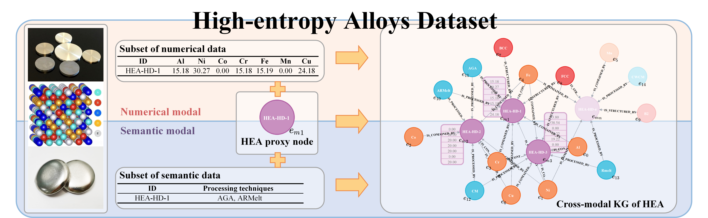
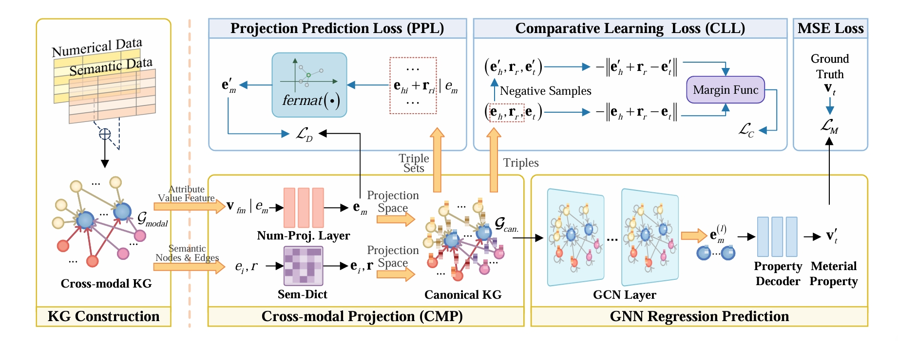

# Bridging the Semantic-Numerical Gap: A Numerical Reasoning Method of Cross-modal Knowledge Graph for Material Property Prediction

Official code for "Bridging the Semantic-Numerical Gap: A Numerical Reasoning Method of Cross-modal Knowledge Graph for Material Property Prediction"

## Dependencies


```commandline
conda create -n NRKG python=3.8
conda activate NRKG

# Please install PyTorch according to your CUDA version.
conda install pytorch==1.13.1 torchvision==0.14.1 torchaudio==0.13.1 cpuonly -c pytorch

pip install -r requirements.txt
```

## HEA dataset


We proposed two high-entropy alloy (HEA) datasets, `HEA-HD` and `HEA-CRD`. `HEA-HD` is a hardness dataset of HEAs, and `HEA-CRD` is a corrosion resistance dataset of HEAs.

We also provide the cross-modal knowledge graph based on the dataset, which is in `./dataset/HEA-HD-KG` and `./dataset/HEA-CRD-KG`. The `entity.pkl` and `relation.pkl` are the entity and relation information. Please use the `pickle` library to read.

## NR-KG Framework


### Project Directory Structure

```commandline
NR-KG
├───dataset
│   ├───HEA-CRD-KG
│   ├───HEA-CRD-Ori
│   ├───HEA-HD-KG
│   └───HEA-HD-Ori
├───model
│   └───pre_trained
│       ├───HEA-CRD
│       └───HEA-HD
├───res
├───tools
├───utils
├───GCN_model.py
├───main.py
├───requirements.txt
├───LICENSE
└───README.md
```

### Train NR-KG

To train the NR-KG model on the HEA-HD dataset, run the following command:

```commandline
python main.py --root_path ./ --dataaddr ./dataset --n_fold 6 
--seed 523 --data_seed 2021 --id 0 --epoch 2000 --fp16 False --hidden_size 128 --num_layers 2 --dropout 0.5 --activation LeakyReLU --lr 0.005 --scheduler StepLR --gamma 0.997 --step_size 1 --a_CLL_loss 0.16 --a_MSELoss 1.0 --a_PPL_Loss 0.04 --patience 50 --early_stop True --KGtype HEA-HD-KG --gpu 0 --state train
```

To train the NR-KG model on the HEA-CRD dataset, run the following command:

```commandline
python main.py --root_path ./ --dataaddr ./dataset  --n_fold 6 --seed 23 --data_seed 2024 --id 1 --epoch 2000 --fp16 False --hidden_size 128 --num_layers 2 --dropout 0.5 --activation LeakyReLU --lr 0.001 --scheduler StepLR --gamma 0.997 --step_size 1 --a_CLL_loss 0.16 --a_MSELoss 1.0 --a_PPL_Loss 0.02  --patience 50 --early_stop True --KGtype HEA-CRD-KG --gpu 0 --state train
```

### Test NR-KG

To test the NR-KG model on the HEA-HD dataset using the checkpoint, run the following command:

```commandline
, run the following command:

```commandline
python main.py --root_path ./ --dataaddr ./dataset --net_path ./model/pre_trained/HEA-HD --n_fold 6 --seed 523 --data_seed 2021 --id 5005 --KGtype HEA-HD-KG --gpu 0 --state test
```

To test the NR-KG model on the HEA-CRD dataset using the checkpoint, run the following command:

```commandline
python main.py --root_path ./ --dataaddr ./dataset  --net_path ./model/pre_trained/HEA-CRD --n_fold 6 --seed 99 --data_seed 2024 --id 5005 --KGtype HEA-CRD-KG --gpu 0 --state test
```

The test results will be saved in the `./res` folder. The results in this paper are run on `NVIDIA RTX 1080Ti`.

**HEA-HD Dataset Results**: The results of 6-fold cross-validation are as follows:

| Fold | MAE | RMSE | R2 |
| --- | --- | --- | --- |
| 0 | 2.55 | 1.16 | 0.43 |
| 1 | 2.14 | 1.19 | 0.66 |
| 2 | 1.73 | 0.99 | 0.58 |
| 3 | 1.52 | 1.01 | 0.46 |
| 4 | 1.38 | 0.98 | 0.73 |
| 5 | 3.94 | 1.40 | 0.33 |
| Ave. ± Std. | 2.21±0.95 | 1.12±0.16 | 0.53±0.15 |

**HEA-CRD Dataset Results**: The results of 6-fold cross-validation are as follows:

| Fold | MAE | RMSE | R2 |
| --- | --- | --- | --- |
| 0 | 2958 | 38.72 | 0.92 | 
| 1 | 4467 | 47.27 | 0.85 | 
| 2 | 2677 | 37.93 | 0.90 | 
| 3 | 3592 | 44.83 | 0.88 | 
| 4 | 4793 | 48.13 | 0.84 | 
| 5 | 2636 | 40.90 | 0.89 | 
| Ave. ± Std. | 3520±931 | 42.96±4.39 | 0.88±0.03 | 

## Citation

If you find this code useful in your research, please consider citing our paper.

bib格式将在论文发表后提供。

## Contact

If you have any questions, feel free to contact me via `issue` or email (sguangxuan@163.com).